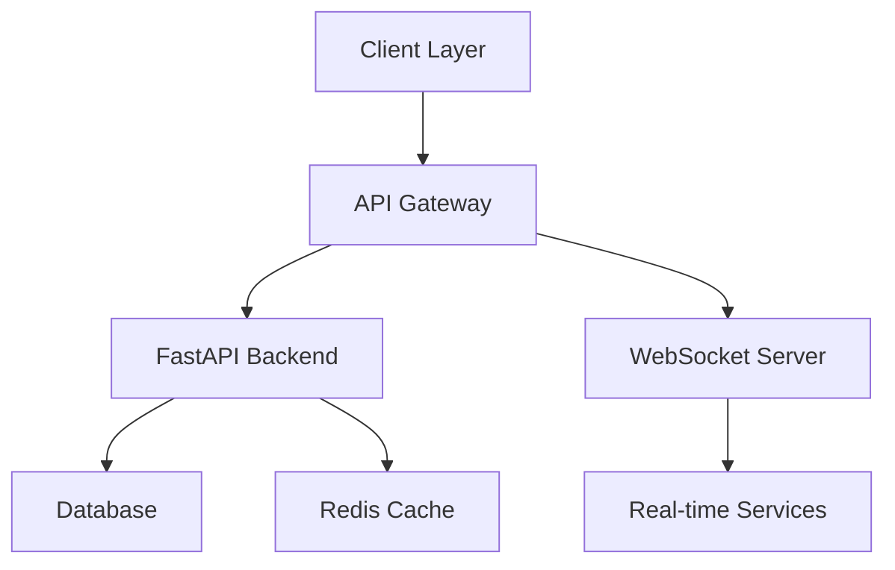
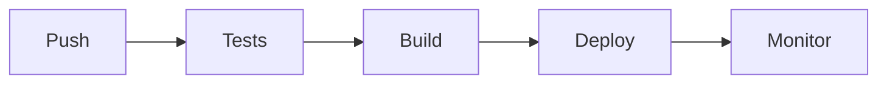

# Echo 🚀

<div align="center">


**A cutting-edge full-stack application combining Next.js frontend with FastAPI backend for real-time communication and data processing.**

[](https://opensource.org/licenses/MIT)
[](https://www.python.org/)
[](https://fastapi.tiangolo.com/)
[](https://nextjs.org/)
[](https://www.docker.com/)
[](https://www.typescriptlang.org/)
[](https://reactnative.dev/)

[📘 Documentation](docs/README.md) • [🚀 Quick Start](#quick-start) • [🌟 Features](#features) • [📱 Mobile App](#mobile-application) • [🤝 Contributing](.github/CONTRIBUTING.md)

</div>

## 🌟 Features

### Core Capabilities
- **🔄 Real-time Communication**
  - WebSocket integration for instant updates
  - Server-Sent Events (SSE) support
  - Bi-directional data flow  
  
- **🎯 High Performance**
  - Optimized database queries
  - Redis caching layer
  - Load balancing ready  
  
- **🔒 Security First**
  - JWT authentication
  - Rate limiting
  - CORS protection
  - Input validation  
  
- **📱 Cross-Platform**
  - Responsive web interface
  - Native mobile apps
  - Progressive Web App (PWA)  
  
### Technical Stack
- **Frontend**
  - Next.js 13+ with App Router
  - TypeScript for type safety
  - TailwindCSS for styling
  - Redux Toolkit for state management  
  
- **Backend**
  - FastAPI with async support
  - SQLAlchemy ORM
  - Alembic migrations
  - Pydantic models  
  
- **Mobile**
  - React Native
  - Native modules integration
  - Offline-first architecture  
  
- **DevOps**
  - Docker containerization
  - GitHub Actions CI/CD
  - Automated testing
  - Monitoring & logging

## 🏗 Architecture



## 📁 Project Structure

```
echo/
├── .github/                # GitHub workflows and templates
│   ├── workflows/         # CI/CD pipeline definitions
│   └── CONTRIBUTING.md    # Contribution guidelines
├── backend/               # FastAPI backend service
│   ├── app/              # Application code
│   ├── tests/            # Backend tests
│   └── Dockerfile        # Backend container definition
├── frontend/             # Next.js frontend
│   ├── components/       # Reusable UI components
│   ├── pages/           # Application routes
│   └── styles/          # Global styles and themes
├── mobile/              # React Native mobile app
│   ├── android/         # Android specific code
│   ├── ios/            # iOS specific code
│   └── src/            # Shared mobile code
├── docs/               # Project documentation
│   ├── api/           # API documentation
│   ├── architecture/  # System design docs
│   └── guides/        # User and developer guides
├── scripts/           # Utility scripts
└── docker-compose.yml # Container orchestration
```

## 🚀 Quick Start

### Prerequisites
- Docker and Docker Compose
- Node.js 16+
- Python 3.8+
- Git

### Installation

1. **Clone the Repository**
   ```bash
   git clone https://github.com/Ak2556/echo.git
   cd echo
   ```

2. **Environment Setup**
   ```bash
   # Copy environment files
   cp .env.example .env
   
   # Install dependencies
   make install
   # or manually:
   npm install        # Frontend deps
   pip install -r requirements.txt  # Backend deps
   ```

3. **Start Development Environment**
   ```bash
   # Using Docker
   docker-compose up -d

   # Or manually:
   npm run dev       # Frontend: http://localhost:3000
   python main.py    # Backend: http://localhost:8000
   ```

4. **Verify Installation**
   - Frontend: [http://localhost:3000](http://localhost:3000)
   - Backend: [http://localhost:8000/docs](http://localhost:8000/docs)
   - Admin: [http://localhost:8000/admin](http://localhost:8000/admin)

## 📱 Mobile Application

The Echo mobile app provides native iOS and Android experiences with features like:
- Push notifications
- Offline data sync
- Native device integration
- Biometric authentication

### Mobile Setup
```bash
cd mobile
npm install
npx pod-install  # iOS only

# Run on iOS
npm run ios

# Run on Android
npm run android
```

## 💻 Development

### Code Style
- Frontend: ESLint + Prettier
- Backend: Black + isort
- Pre-commit hooks enabled

### Running Tests
```bash
# Backend tests
pytest

# Frontend tests
npm test

# E2E tests
npm run cypress
```

### Database Migrations
```bash
# Create migration
alembic revision --autogenerate -m "description"

# Run migrations
alembic upgrade head
```

## 📚 Documentation

Visit our [documentation site](docs/README.md) for:
- [API Reference](docs/api/README.md)
- [Architecture Guide](docs/architecture/README.md)
- [Deployment Guide](docs/deployment/README.md)
- [Contributing Guide](.github/CONTRIBUTING.md)

## 🔄 CI/CD Pipeline



- Automated testing on pull requests
- Docker image builds
- Automated deployments
- Performance monitoring

## 🤝 Contributing

We love your input! See our [Contributing Guidelines](.github/CONTRIBUTING.md) for ways to:
- Report bugs
- Discuss the current state
- Submit fixes
- Propose new features
- Become a maintainer

## 📄 License

This project is licensed under the MIT License - see the [LICENSE](LICENSE) file for details.

## 📞 Support & Community

- 📧 [Email Support](mailto:support@echo-project.com)
- 💬 [Discord Community](https://discord.gg/echo)
- 🐦 [Twitter Updates](https://twitter.com/echo_project)
- 📝 [Blog](https://echo-project.com/blog)

## 🙏 Acknowledgments

Special thanks to:
- Our amazing contributors
- The open source community
- All the tools and libraries that make this possible

---

<div align="center">

**[⬆ Back to Top](#echo-)**

Made with ❤️ by the Echo Team

Last updated: 2025-10-12

</div>